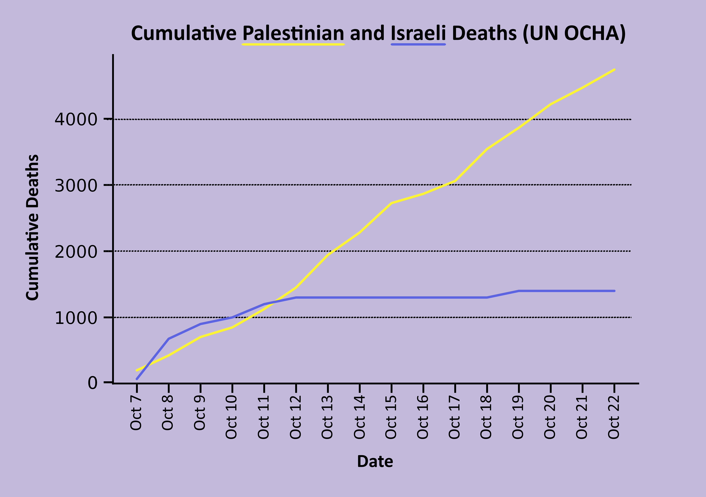
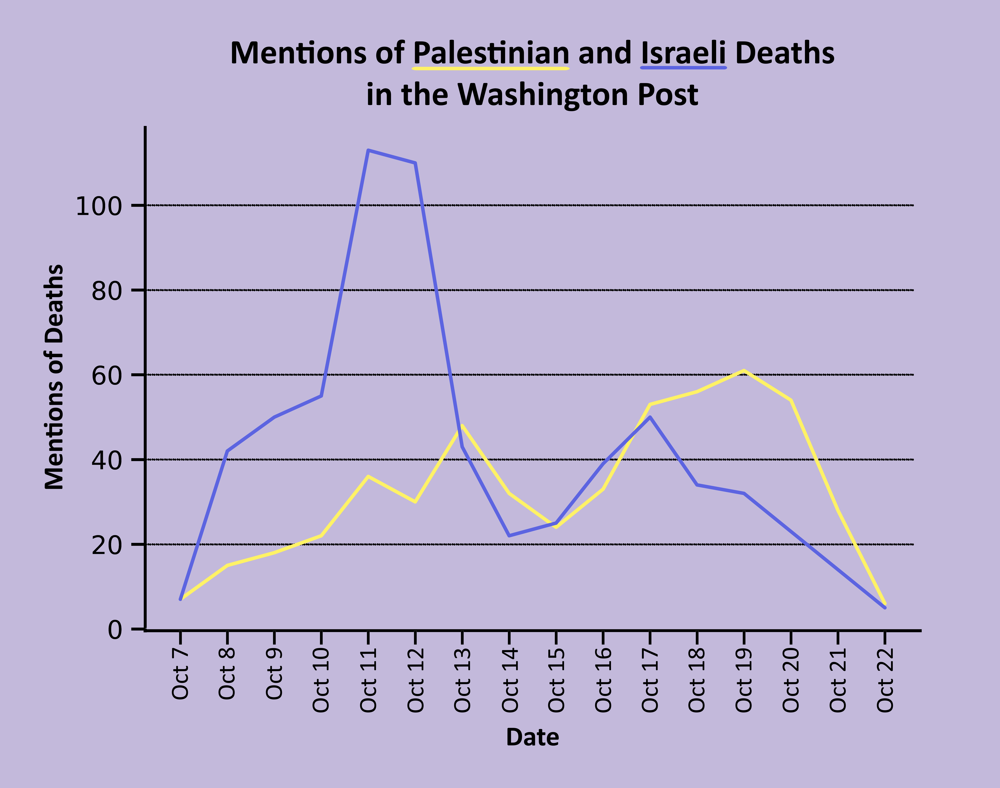
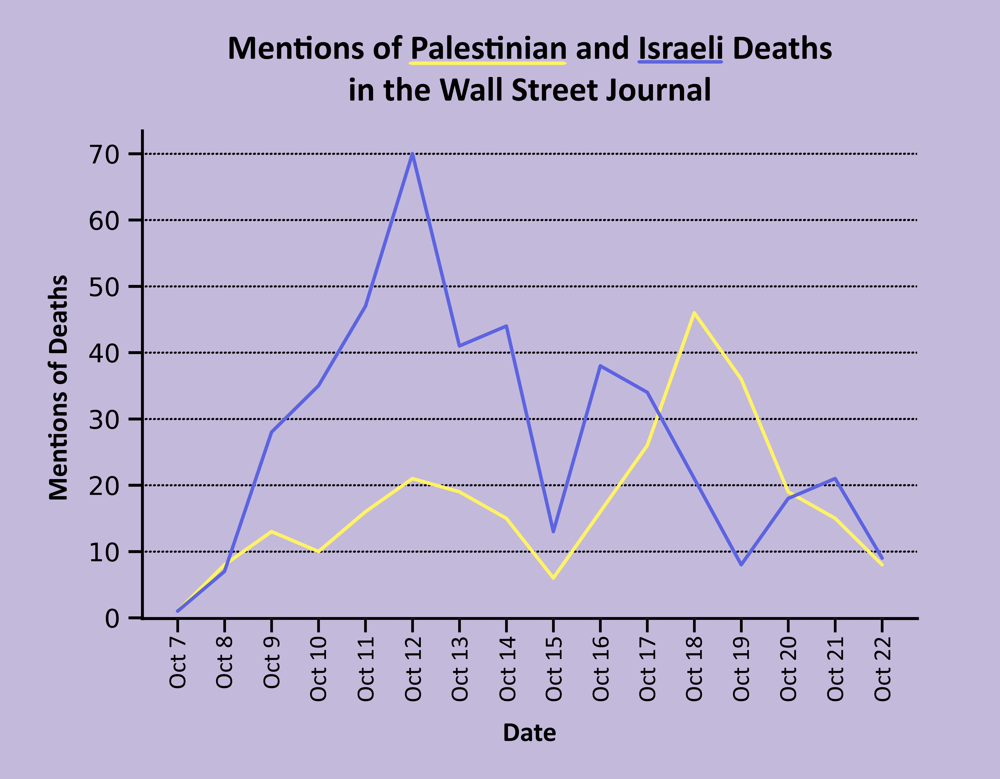
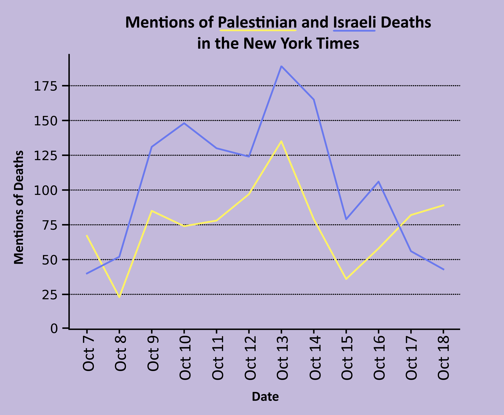

This live document and repository provide a transparent overview of the methods, data, and code behind the analysis of anti-Palestinian media bias in _The New York Times_ and other mainstream US newspapers since October 7, 2023.  All data, code, and analysis were produced by Holly Jackson, a graduate student of computer science at the University of California, Berkeley.

Snapshots from this research have been posted on Instagram at the following links:
* [Post](https://www.instagram.com/p/Cy8iWSfukzE/) by Mona Chalabi on October 28, 2023.
* [Post](https://www.instagram.com/p/Cyl9HR7O4ap/) by Mona Chalabi on October 19, 2023.

**Please note:** This project is being completed live to keep up with the urgency of current events.  As a result, all graphs and images posted are subject to updates and corrections, which will be posted in the [**Updates and Corrections**](https://github.com/hollyjackson/casualty_mentions_nyt/blob/main/README.md#updates-and-corrections) section of this document.  Please use the most up-to-date content if you are reporting on the results.  I am working to make this project as _transparent_ as possible in methodology and results so anyone from the public can audit and replicate the results.  If you find any mistakes or problems in this repository, please let me know.  My inbox is always open at [holly_jackson@berkeley.edu](mailto:hollyjackson@berkeley.edu).

## Overview 

In this study, I aim to provide data on mentions of Palestinian and Israeli deaths in _The New York Times_ and other mainstream US newspapers since October 7, 2023.  I compare this data to up-to-date casualty counts from the United Nations Office for the Coordination of Humanitarian Affairs (OCHA).

Below, I provide an overview of the entire pipeline to produce the results.

There are four main steps:
1. I filter the **source data**, i.e. articles from the _New York Times_, for relevant content.
2. I pre-process all of the article data using a popular and reliable **natural language processing** pipeline: [Stanford CoreNLP](https://stanfordnlp.github.io/CoreNLP/).  I use Stanford CoreNLP to parse the grammatical structure of the sentences in the articles.
3. I use the results from pre-processing to automatically filter any sentences related to death.  Then, I **manually tag** whether the victim in each sentence is Palestinian, Israeli, both (i.e. for multiple victims), or neither (i.e. something unrelated).
4. Finally, I compare the results to **cumulative casualty counts** from the United Nations Office for the Coordination of Humanitarian Affairs (OCHA).

The aim is for these results to be fully replicable for those who have access to the article source data.

### 1. Dataset

All article data from these newspapers was collected and analyzed through ProQuest TDM (Text and Data Mining) Studio.  ProQuest is a collection of many databases that provide access to thousands of journals, magazines, newspapers, dissertations, and other publications.  TDM Studio is a text and data mining solution for research, teaching and learning that allows researchers to analyze ProQuest's collections.

Through ProQuest TDM Studio, I have acces to all print and online articles in _The New York Times_, _The Washington Post_, _The Wall Street Journal_, and more.  Unfortunately, due to most newspapers' terms and conditions on data scraping, the original source data cannot be shared from ProQuest TDM Studio, so I do not have the rights to upload it to this repository.  However, all article data can be downloaded or copied manually from the respective newspapers' website.

I produced a number of datasets for this research:
1. I identified all articles posted by _The New York Times_ between October 7, 2023, and October 18, 2023, that contained any of the keywords: Palestine, Israel, Palestinian, or Israeli.  In total, there were 991 articles that matches these search criteria.  All articles were downloaded as of 6pm ET on October 18.
2. I identified all articled posted by _The New York Times_ between October 7, 2023, and October 22, 2023, hat contained any of the keywords: Palestine, Israel, Palestinian, or Israeli.  In total, there were 1325 articles that matches these search criteria.  All articles were downloaded as of 5pm ET on October 22.
3. I identified all articled posted by _The Washington Post_ between October 7, 2023, and October 22, 2023, hat contained any of the keywords: Palestine, Israel, Palestinian, or Israeli.  In total, there were 678 articles that matches these search criteria.  All articles were downloaded as of 5pm ET on October 22.
4. I identified all articled posted by _The Wall Street Journal_ between October 7, 2023, and October 22, 2023, hat contained any of the keywords: Palestine, Israel, Palestinian, or Israeli.  In total, there were 669 articles that matches these search criteria.  All articles were downloaded as of 5pm ET on October 22.

These three newspapers (_New York Times_, _Washington Post_, and _Wall Street Journal_) were chosen for a number of reasons.  First, multiple online sources listed them among the most read newspapers in the US (see [this article from Press Gazette](https://pressgazette.co.uk/media-audience-and-business-data/media_metrics/top-25-us-newspaper-circulations-down-march-2023/) which ranks the _Wall Street Journal_, _New York Times_, and _Washington Post_ as the US's most-circulated newspapers as of 2023 and [this 2021 report from Pew Research](https://www.pewresearch.org/journalism/fact-sheet/newspapers/) which refers to the _New York Times_, _Wall Street Journal_, and _Washington Post_ as "three of the highest-circulation daily papers in the U.S.").  Second, I was limited by dataset availability (I do not have access to sources like CNN and MSN).  Despite this, there are many mainstream newspapers that would be critical to investigate in addition (such as _USA Today_ and the _LA Times_).


### 2. Data Pre-Processing

For each article of the pre-filtered articles, I applied Stanford CoreNLP to derive linguistic annotations for text, including token and sentence boundaries, parts of speech, named entities, and dependency and constituency parses.

The script ```code/data-processing.py``` prepares the articles from the ProQuest database for analysis with Stanford CoreNLP.

After running the data processing script, I use Java (v.1.8) to process all the articles with Stanford CoreNLP using the following command:

```bash
java -Xmx10g -cp "*" edu.stanford.nlp.pipeline.StanfordCoreNLP -annotators tokenize,ssplit,pos,lemma,ner,depparse -filelist all-files.txt -outputFormat json -outputDirectory ../results -threads 6
```

where ```all-files.txt``` sequentially lists the filenames of each article to be processed.

### 3. Automated and Manual Tagging

Using the linguistic annotations from Stanford CoreNLP, I automatically extract all sentences with verbs related to death using a pre-compiled word bank.  I built a simple user interface that presents each sentence to the annotator and asks them to identify the victim described in the sentence as either Palestinian, Israeli, both (if the sentence contains multiple victims), or none (if the sentence is unrelated to Palestine and Israel).

The data is manually tagged according to the following general rules:
* The victim must be Palestinian or Israeli or the death otherwise occured in the West Bank, Gaza, or Israel ('48 lands)
* The mention cannot be speculative (i.e. "He may die") and must have already happened
* The mention must refer to a fatality event that has happened on or since 10/7
* Injuries do not count

There is also an option for 'Next', if the sentence contains insufficient details for classification.  If the annotator selects 'Next', the sentence is shown in context with the three preceding and three following sentences.  If there is still insufficient details, the annotator can select 'Next' one more time to display the entire text of the article.

The script ```code/fatality-analysis-semi-auto.py``` performs the automatic tagging and displays the user interface for manual tagging.  Any sentences tagged 'Palestine' or 'Israel' are saved to CSV files aling with relevant article metadata.

I repeated this process for multiple datasets and produced files of the manually-tagged results:
1. For _New York Times_ articles (print and online) between October 7, 2023, and October 18, 2023, the manually-tagged results are stored in ```data/tagged_data_nyt_oct7_to_oct18.csv```.
2. For _New York Times_ articles (print and online)  between October 7, 2023, and October 22, 2023, the manually-tagged results are stored in ```data/tagged_data_nyt_oct7_to_oct18.csv``` and ```data/tagged_data_nyt_oct18_to_oct22.csv```.  I only manually tagged articles that had not already been classified in the previous NYT dataset that was downloaded on October 18.  However, this means that any updates to articles from October 7, 2023 through October 18, 2023 made after October 18 are not counted.
3. For _Washington Post_ articles (print and online)  between October 7, 2023, and October 22, 2023, the manually-tagged results are stored in ```data/tagged_data_wp_oct7_to_oct22.csv```.
4. For _Wall Street Journal_ articles (print and online)  between October 7, 2023, and October 22, 2023, the manually-tagged results are stored in ```data/tagged_data_wp_oct7_to_oct22.csv```.

### 4. Comparisons to UN fatality data 

I compiled casualty data for Israelis and Palestinians from October 7, 2023, to October 22, 2023, from the United Nations Office for the Coordination of Humanitarian Affairs (OCHA).  The spreadsheet ```data/ocha_data_oct7_to_oct22.csv``` contains casualty data from the West Bank, Gaza, and Israel with labeled with the respective OCHA sources for each day.

This data can be used to produce a number of interesting metrics.  Fatality counts can be compared side-by-side to plots of mentions of Palestinian and Israeli deaths in each newspaper  In addition, dividing the number of fatalities by the number of mentions of deaths can produce a ratio of deaths-per-mention, i.e. how many people die per each mention in a newspaper.



## Results 

All tagged data can be found in the ```data``` subdirectory, and all images can be found in the ```images``` subdirectory.

### _The New York Times_ 


_The New York Times_ has consistently mentioned Israeli deaths more often than Palestinian deaths overall from 10/7 to 10/22. Israeli deaths have been mentioned the most on 10/12 and 10/13, even though Israeli deaths plateaued since 10/12 and Palestinian deaths have skyrocketed.  Coverage of Israeli deaths *increased* as Palestinian deaths began to skyrocket.  On average, about four Palestinians died per each mention of Palestinian deaths in _The New York Times_.  On the other hand, Israeli deaths were matched almost exactly one-for-one by the _Times_.

Please read the notes below on this data -- it’s crucial context.

* In addition to the bias in sheer volume of coverage, there was a huge difference in the language used. The word “slaughter” was used 53 times in these articles since 10/7 to describe the deaths of Israelis and zero times to describe the death of Palestinians. The word “massacre” shows up 24 times in reference to Israelis and once in reference to Palestinians in the tagged sentences.
* The articles rarely mention the names of Palestinians who die — instead using terms like “mourner”, “resident”, “assailant” or “militant”.
* In one article, a murdered Palestinian was simply referred to as the “bloodied corpse” of a presumed "terrorist". This is still counted as a mention of a Palestinian death in the data despite the framing. Israelis who died were often mentioned individually and by name with reference to their families and professions which humanized them in comparison to anonymous Palestinians.

### _The Washington Post_



_The Washington Post_ has consistently mentioned Israeli deaths more often than Palestinian deaths overall from 10/7 to 10/22. Israeli deaths have been mentioned the most on 10/12 and 10/13, even though Israeli deaths plateaued since 10/12 and Palestinian deaths have skyrocketed.  On average, about nine Palestinians died per mention of Palestinian deaths in _The Washington Post_.  On the other hand, two Israelis died per mention of Israeli deaths in the _Post_.

### _The Wall Street Journal_



_The Wall Street Journal_ has consistently mentioned Israeli deaths more often than Palestinian deaths overall from 10/7 to 10/22. Israeli deaths have been mentioned the most on 10/12 and 10/13, even though Israeli deaths plateaued since 10/12 and Palestinian deaths have skyrocketed.  On average, about 17 Palestinians died per mention of Palestinian deaths in _The Wall Street Journal_.  On the other hand, three Israelis died per mention of Israeli deaths in the _WSJ_.

## Updates and Corrections

[10/23/2023] Please note, there is a discrepancy in the dates in the chart of _New York Times_ death mentions in [this post](https://www.instagram.com/p/Cyl9HR7O4ap/), discovered several days after it was originally uploaded.  Dates were accidentally selected from the neighboring article.  Please note that all death mention information is still entirely accurate and all trends explained in the post still hold true.  The corrected chart is shown below.




## Potential Sources of Bias and Error

During data collection, I used pre-trained natural languag processing models to parse the grammatical structure of all sentences in each article.  It is important to contextualize that pre-trained natural language processing models do not provide unbiased metrics.  Since they are trained on a corpus of texts that have Orientalist sentiments, the classifiers themselves carry this same anti-Arab, anti-Muslim bias.  Studies have found persistent sexist, racist, and Islamophobic bias in highly-used natural language processing toolkits (Abid et al., 2021; Bolukbasi et al., 2016; Bordia and Bowman, 2019; Lu et al., 2020; Nadeem et al., 2020; Shearer et al., 2019; Sheng et al., 2019).  As a result, the results should be considered in the context of anti-Palestinian bias in artificial intelligence tools, indicating anti-Palestinian bias is likely deeper than these results are capable of measuring.

In addition, manually tagging data can be subjective and can of course suffer from human error.  To minimize subjectivity, the data was manually tagged according to the following general rules:
* The victim must be Palestinian or Israeli or the death otherwise occured in the West Bank, Gaza, or Israel ('48 lands)
* The mention cannot be speculative (i.e. "He may die") and must have already happened
* The mention must refer to a fatality event that has happened on or since 10/7
* Injuries do not count


## Requirements and Implementation Details

This codebase was run using python 3.9 on a Linux machine.

It requires a number of natural language processing libraries:

* [spaCy](https://spacy.io/)
* [NLTK](https://www.nltk.org/)
* [Stanford CoreNLP](https://stanfordnlp.github.io/CoreNLP/)

All other required libraries can all be installed as follows:

```bash
pip3 install -r requirements.txt
```