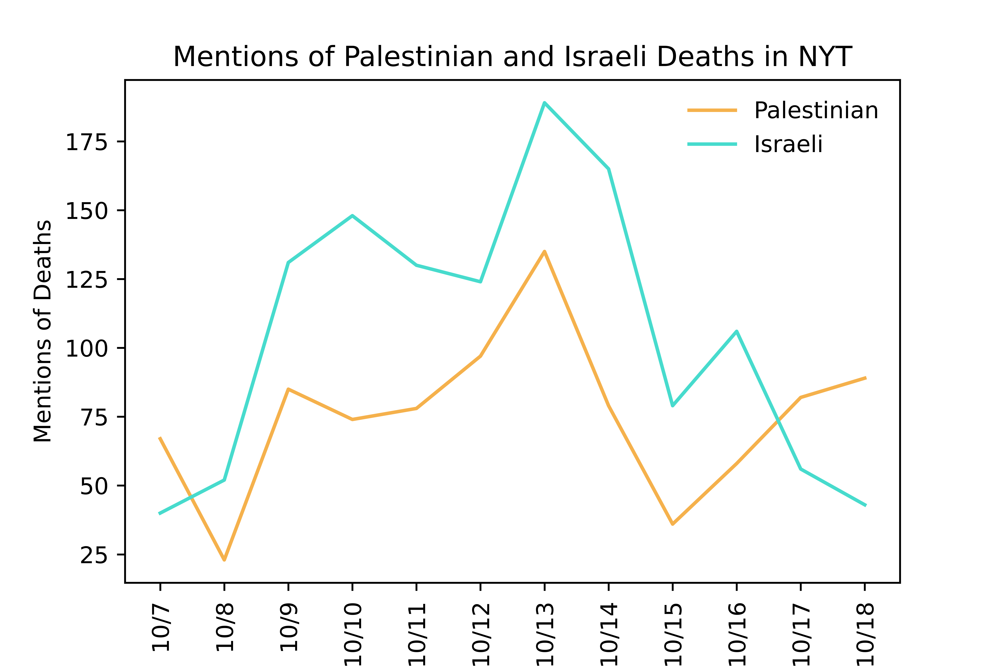

This live document and repository provide a transparent overview of the methods, data, and code behind the analysis of death mentions in _The New York Times_ as reported [on Instagram](https://www.instagram.com/p/Cyl9HR7O4ap/) by Mona Chalabi on October 19, 2023.

Because this project is being completed **live** to keep up with current events, please note all graphs and images posted are subject to updates and corrections.  All updates and corrections to the graphs can be found in the [**Updates and Corrections**](https://github.com/hollyjackson/casualty_mentions_nyt/blob/main/README.md#updates-and-corrections) section of this document.  We are working to make this project as _transparent_ as possible in methodology and results.

All data, code, and analysis were produced by Holly Jackson, a graduate student of computer science at the University of California, Berkeley.

## Overview 

Below, I provide an overview of the entire pipeline to produce the results.

There are four main steps:
1. I filter the **source data**, i.e. articles from the _New York Times_, for relevant content.
2. I pre-process all of the article data using a popular and reliable **natural language processing** pipeline: [Stanford CoreNLP](https://stanfordnlp.github.io/CoreNLP/).  I use Stanford CoreNLP to parse the grammatical structure of the sentences in the articles.
3. I use the results from pre-processing to automatically filter any sentences related to death.  Then, I **manually tag** whether the victim in each sentence is Palestinian, Israeli, both (i.e. for multiple victims), or neither (i.e. something unrelated).
4. Finally, I compare the results to **cumulative casualty counts** from the United Nations Office for the Coordination of Humanitarian Affairs (OCHA).

The aim is for these results to be fully replicable for those who have access to the article source data.

### 1. Dataset

All article data from _The New York Times_ was collected and analyzed through ProQuest TDM (Text and Data Mining) Studio.  ProQuest is a collection of many databases that provide access to thousands of journals, magazines, newspapers, dissertations, and other publications.  TDM Studio is a text and data mining solution for research, teaching and learning that allows researchers to analyze ProQuest's collections.  Unfortunately, due to NYT terms and conditions on data scraping, the original source data cannot be shared from ProQuest TDM Studio, so I do not have the rights to upload it to this repository.  However, all NYT article data can be downloaded manually from the NYT website.

Through ProQuest TDM studio, I have acces to all print and online articles in _The New York Times_.  I identified all articles posted by _The New York Times_ between October 7, 2023, and October 18, 2023, that contained any of the keywords: Palestine, Israel, Palestinian, or Israeli.  In total, there were 991 articles that matches these search criteria.

### 2. Data Pre-Processing

For each article of the 991 pre-filtered articles, I applied Stanford CoreNLP to derive linguistic annotations for text, including token and sentence boundaries, parts of speech, named entities, and dependency and constituency parses.

The script ```data-processing.py``` prepares the articles from the ProQuest database for analysis with Stanford CoreNLP.

After running the data processing script, I use Java (v.1.8) to process all the articles with Stanford CoreNLP using the following command:

```bash
java -Xmx10g -cp "*" edu.stanford.nlp.pipeline.StanfordCoreNLP -annotators tokenize,ssplit,pos,lemma,ner,depparse -filelist all-files-israel-palestine-war.txt -outputFormat json -outputDirectory ../results/israel_palestine_war -threads 6
```

where ```all-files-israel-palestine-war.txt``` sequentially lists the filenames of each article to be processed.

### 3. Automated and Manual Tagging

Using the linguistic annotations from Stanford CoreNLP, I automatically extract all sentences with verbs related to death using a pre-compiled word bank.  Five hundred of the 991 articles contained sentences related to death.  I built a simple user interface that presents each sentence to the annotator and asks them to identify the victim described in the sentence as either Palestinian, Israeli, both (if the sentence contains multiple victimes), or none (if the sentence is unrelated to Palestine and Israel).

The data is manually tagged according to the following general rules:
* The victim must be Palestinian or Israeli or the death otherwise occured in the West Bank, Gaza, or Israel ('48 lands)
* The mention cannot be speculative (i.e. "He may die") and must have already happened
* The mention must refer to a fatality event that has happened on or since 10/7
* Injuries do not count

There is also an option for 'Next', if the sentence contains insufficient details for classification.  If the annotator selects 'Next', the sentence is shown in context with the three preceding and three following sentences.  If there is still insufficient details, the annotator can select 'Next' one more time to display the entire text of the article.

The script ```fatality-analysis-semi-auto.py``` performs the automatic tagging and displays the user interface for manual tagging.  Any sentences tagged 'Palestine' or 'Israel' are saved to CSV files aling with relevant article metadata.

All of the manually-tagged results are compiled in ```tagged_data.csv```.

### 4. Comparisons to UN fatality data 

To produce the second chart, I compiled casualty data for Israelis and Palestinians from October 7, 2023, to October 18, 2023, from the United Nations Office for the Coordination of Humanitarian Affairs.  The spreadsheet ```ocha_data_comparison.csv``` contains casualty data from the West Bank, Gaza, and Israel with labeled with their respective OCHA sources for each day.  In addition, the final death mention counts from step 3 are included in the final for ease of plotting.

## Updates and Corrections

1. Please note, there is a discrepancy in the dates in the chart of _New York Times_ death mentions in [this post](https://www.instagram.com/p/Cyl9HR7O4ap/).  Dates were accidentally selected from the neighboring article.  Please note that all death mention information is still entirely accurate.  The fully-updated trends are shown below.



## Results 

The New York Times has consistently mentioned Israeli deaths more often than Palestinian deaths. On average, about 4 Palestinians had to die to receive a mention of Palestinian deaths in _The New York Times_.  On the other hand, Israeli deaths were matched almost exactly one-for-one by the _Times_.

Please read the notes below on this data -- it’s crucial context.

* In addition to the bias in sheer volume of coverage, there was a huge difference in the language used. The word “slaughter” was used 53 times in these articles since 10/7 to describe the deaths of Israelis and zero times to describe the death of Palestinians. The word “massacre” shows up 24 times in reference to Israelis and once in reference to Palestinians.
* The articles rarely mention the names of Palestinians who die — instead using terms like “mourner”, “resident”, “assailant” or “militant”.
* In one article, a murdered Palestinian was simply referred to as the “bloodied corpse” of a presumed terrorist. This is still counted as a mention of a Palestinian death in the data despite the framing. Israelis who died were often mentioned individually and by name with reference to their families and professions which humanized them in comparison to anonymous Palestinians.


## Requirements and Implementation Details

This codebase was run using python 3.9 on a Linux machine.

It requires a number of natural language processing libraries:

* [spaCy](https://spacy.io/)
* [NLTK](https://www.nltk.org/)
* [Stanford CoreNLP](https://stanfordnlp.github.io/CoreNLP/)

All other required libraries can all be installed as follows:

```bash
pip3 install -r requirements.txt
```


## Note on potential biases during the tagging process

During data collection, I used pre-trained natural languag processing models to parse the grammatical structure of all sentences in each article.  It is important to contextualize that pre-trained natural language processing models do not provide unbiased metrics.  Since they are trained on a corpus of texts that have Orientalist sentiments, the classifiers themselves carry this same anti-Arab, anti-Muslim bias.  Studies have found persistent sexist, racist, and Islamophobic bias in highly-used natural language processing toolkits (Abid et al., 2021; Bolukbasi et al., 2016; Bordia and Bowman, 2019; Lu et al., 2020; Nadeem et al., 2020; Shearer et al., 2019; Sheng et al., 2019).  As a result, the results should be considered in the context of anti-Palestinian bias in artificial intelligence tools, indicating anti-Palestinian bias is likely deeper than these results are capable of measuring.

In addition, manually tagging data can be subjective.  To minimize subjectivity, the data was manually tagged according to the following general rules:
* The victim must be Palestinian or Israeli or the death otherwise occured in the West Bank, Gaza, or Israel ('48 lands)
* The mention cannot be speculative (i.e. "He may die") and must have already happened
* The mention must refer to a fatality event that has happened on or since 10/7
* Injuries do not count
