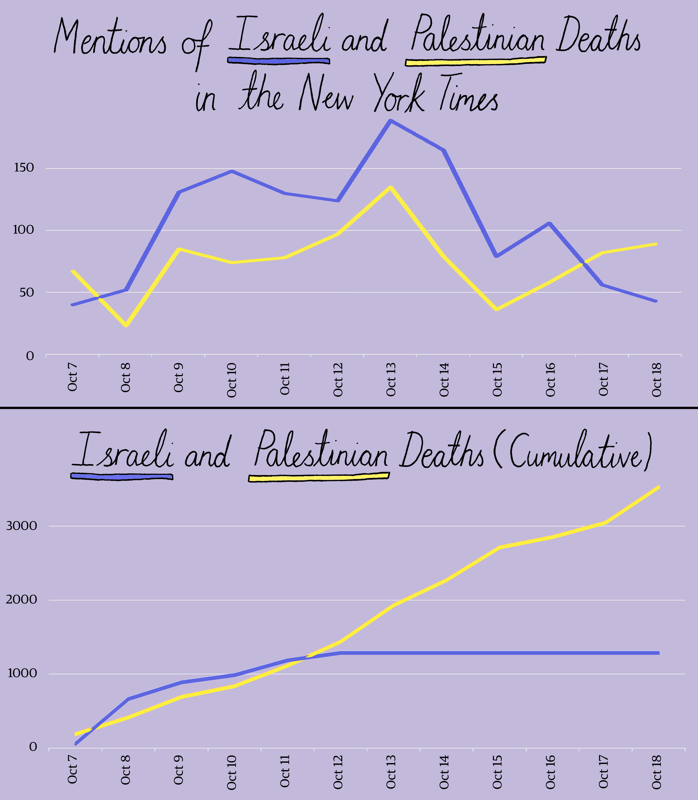
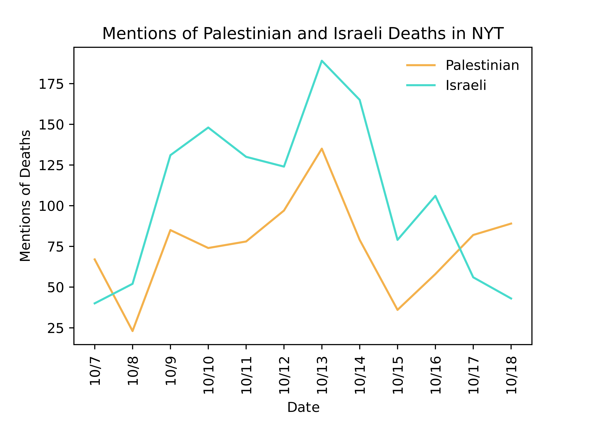
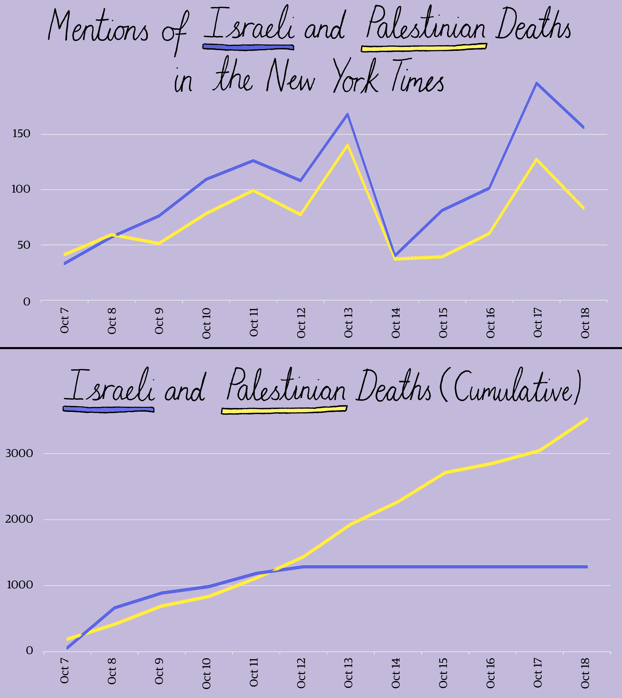
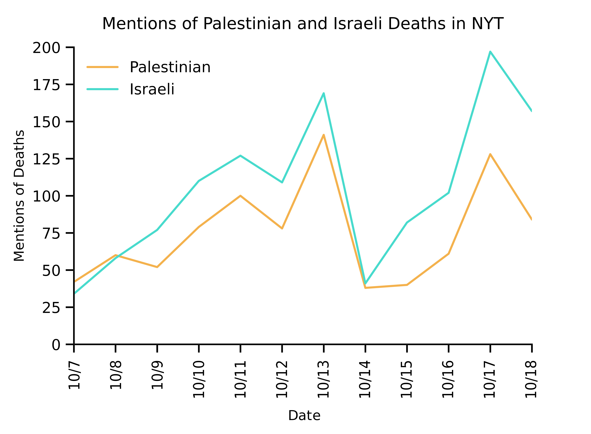

This README includes a brief description of all images in this directory.

# Most up-to-date results

## mentions_styled_nyt.jpg

The top plot shows mentions of Palestinian and Israeli deaths in _The New York Times_ between October 7 and October 18, 2023.  The bottom plot shows cumulative data on Palestinian and Israeli deaths from the United Nations Office for the Coordination of Humanitarian Affairs (OCHA).  Design and styling by Mona Chalabi.  Data by Holly Jackson.




## mentions_nyt.jpg

Unstyled version of ```mentions_styled_nyt.jpg```.



# Past results

## mentions_nyt_styled_ORIGINAL_OFF_BY_ONE.jpg

Original plots from [this post](https://www.instagram.com/p/Cyl9HR7O4ap/) from October 19, 2023.  The top plot shows mentions of Palestinian and Israeli deaths in _The New York Times_ between October 7 and October 18, 2023.  The bottom plot shows cumulative data on Palestinian and Israeli deaths from the United Nations Office for the Coordination of Humanitarian Affairs (OCHA).  Design and styling by Mona Chalabi.  Data by Holly Jackson.  Please note, there is a discrepancy in the dates of this chart.  Dates were accidentally selected from the neighboring article.  Please note that all death mention information is still entirely accurate and all trends explained in the post still hold true.  The file ```mentions_styled_nyt.jpg``` contains the corrected chart.  Please use the corrected chart instead.




## mentions_nyt_ORIGINAL_OFF_BY_ONE.jpg

Unstyled version of ```mentions_nyt_styled_ORIGINAL_OFF_BY_ONE.jpg```.



